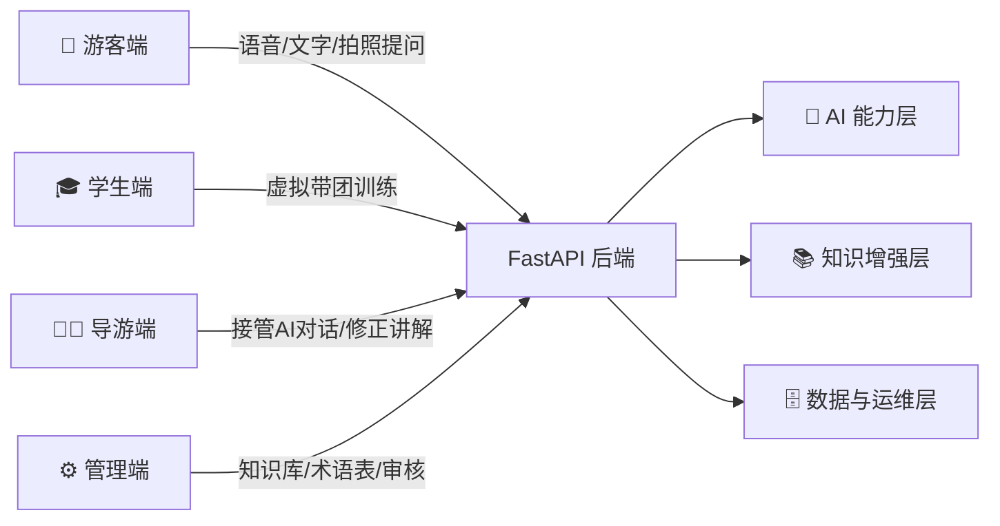
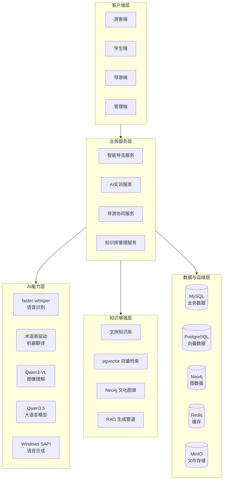
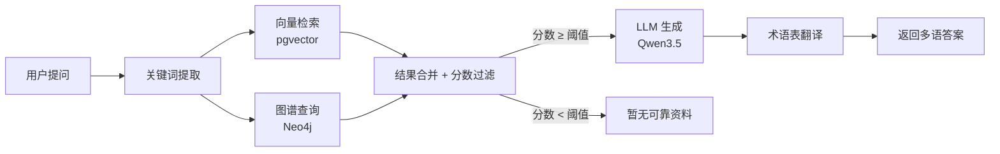

<div align="center">


# 🌏 语界 LinguaSpace

### 面向云南文旅场景的 AI 智能服务平台

**多语交互 · 智能导览 · 拍照识别 · AI 实训 · 导游协同**

<br/>


<br/>


<br/>
<br/>

[📖 项目简介](#-项目简介) · [🏛️ 系统架构](#-系统架构) · [✨ 功能亮点](#-功能亮点) · [📸 项目截图](#-项目截图) · [🚀 快速开始](#-快速开始) · [🛠️ 技术栈](#-技术栈) · [📡 API 接口](#-api-接口) · [📁 项目结构](#-项目结构) · [📚 文档](#-文档)

</div>

<br/>

---

## 📖 项目简介

**语界 LinguaSpace** 是一个面向南亚、东南亚游客的云南文旅 AI 智能服务平台。系统将开源大模型与云南文旅知识库深度结合，构建了一个**可检索、可审核、可持续扩展**的文旅 AI 系统。

不同于简单的 "套壳" 应用，LinguaSpace 在工程层面实现了完整的 **RAG 增强生成管道**、**多模态交互链路** 和 **人机协同机制**，涵盖从游客自助问答到 AI 导游实训的全闭环。

### 🎯 核心设计原则

| 原则 | 说明 |
|:----:|------|
| 🔒 **真实优先** | 后端能力缺失时明确显示"接口待接入"，不使用 mock data 伪装成功 |
| 🚫 **不降级** | MySQL / Redis / MinIO / Neo4j / Ollama 任一不可用时请求直接失败 |
| 🤖 **信任 RAG** | 检索分数低于阈值时返回"暂无可靠资料"，不编造内容 |
| 📖 **术语一致** | 通过术语表确保彝语地名、非遗专名等翻译统一 |

### 🏗️ 四端协同



---

## 🏛️ 系统架构



### 🔗 RAG 问答管道



---

## ✨ 功能亮点

### 🧳 游客端 — 智能导览

| 功能 | 说明 | 技术实现 |
|:-----|:------|:--------|
| 💬 **文本问答** | 多语文旅问答，支持流式输出 | RAG + LLM + 术语翻译 |
| 🎤 **语音问答** | 浏览器录音 → 语音转写 → 智能回答 | MediaRecorder + faster-whisper |
| 📷 **拍照识别** | 上传图片自动识别景点/文物/植物 | Qwen3-VL 视觉理解 + RAG |
| 🗺️ **路线推荐** | 基于兴趣偏好的个性化路线 | 游客画像推断 + 路线匹配 |
| 🔊 **语音合成** | 多语讲解语音播报 | Windows SAPI TTS |
| ⭐ **收藏夹** | 收藏感兴趣的景点/知识 | 用户偏好持久化 |

### 🎓 学生端 — AI 实训

| 功能 | 说明 |
|:-----|:------|
| 🎯 **虚拟带团** | 模拟真实场景中的游客提问 |
| 🎙️ **语音讲解提交** | 录制讲解内容供 AI 评分 |
| 📊 **训练报告** | LLM-as-Judge 多维度评分（知识准确性、语言表达、互动技巧） |
| 📈 **进度追踪** | 查看历史训练记录与成长曲线 |

### 🧑‍🏫 导游端 — 人机协同

| 功能 | 说明 |
|:-----|:------|
| 👀 **会话监控** | 实时查看游客与 AI 的对话 |
| 🤝 **人工接管** | 一键接管 AI 对话，真人介入 |
| ✏️ **内容修正** | 标记并修正 AI 的错误回答 |
| 📋 **案例库** | 优质修正自动沉淀为培训案例 |
| 🔄 **知识回流** | 修正后的内容经审核回写知识库 |

### ⚙️ 管理端 — 知识运营

| 功能 | 说明 |
|:-----|:------|
| 📄 **文档管理** | 上传、切分、向量化、版本管理 |
| 🔍 **图谱管理** | 管理景点、民族、节庆、非遗等实体关系 |
| 📝 **术语表** | 维护多语专有名词翻译一致性 |
| ✅ **内容审核** | 知识发布前的专家审核流程 |
| 📊 **系统监控** | 模型调用日志、请求追踪、健康检查 |

---

## 📸 项目截图

<div align="center">

### 项目概览


<br/><br/>

### 多语智能导览


<br/><br/>

### AI 导游实训


<br/><br/>

### 文化知识图谱


<br/><br/>

### 可信 RAG 管道


<br/><br/>

### 拍照识别场景


<br/><br/>

### 人机协同场景


<br/><br/>

### 路线推荐

| 美食路线 | 文化遗产路线 | 摄影路线 |
|:--------:|:----------:|:-------:|
|  |  |  |

<br/>

### 游客端首页


</div>

---

## 🚀 快速开始

### 前置条件

| 依赖 | 版本要求 | 说明 |
|:----:|:--------:|:-----|
|  | ≥ 3.10 | 后端运行环境 |
|  | ≥ 18 | 前端构建环境 |
|  | 最新版 | 基础设施容器化 |
|  | 最新版 | 本地模型推理 |

**安装 AI 模型：**

```bash
ollama pull qwen3.5:9b
ollama pull qwen3-vl:4b
```

### 一键启动

```powershell
# Windows PowerShell
.\scripts\start-linguaspace.ps1

# 或双击运行
start-linguaspace.bat
```

<details>
<summary>📋 启动脚本自动完成以下步骤</summary>

1. 安装后端 Python 依赖
2. 拉起 Docker 基础设施（MySQL / PostgreSQL+pgvector / Redis / MinIO / Neo4j）
3. 检查 Ollama 模型可用性
4. 引导 MySQL 种子数据
5. 启动 FastAPI 后端（端口 8000）
6. 启动 Vite 前端（端口 5173-5190 自动选择）

</details>

### 停止服务

```powershell
.\scripts\stop-linguaspace.ps1
```

### 访问入口

| 服务 | 地址 | 说明 |
|:----:|:-----|:-----|
| 🌐 | `http://localhost:5173` | 前端页面 |
| 📚 | `http://localhost:8000/docs` | API 文档 (Swagger) |
| 💚 | `http://localhost:8000/api/health` | 健康检查 |
| 📦 | `http://localhost:9001` | MinIO 控制台 |
| 🕸️ | `http://localhost:7474` | Neo4j 浏览器 |

### 环境变量

前端通过 Vite 环境变量读取后端地址：

```env
VITE_API_BASE_URL=http://localhost:8000
VITE_WS_BASE_URL=ws://localhost:8000
```

<details>
<summary>⚙️ 后端环境变量（点击展开）</summary>

后端环境变量参见 `.env.example`，支持配置：
- LLM Provider（默认 Ollama，可选 OpenAI 兼容接口）
- 数据库连接参数
- 文件存储配置
- 日志级别

</details>

---

## 🛠️ 技术栈

### 前端

| 技术 | 版本 | 用途 |
|:----:|:----:|:-----|
|  | 18.3 | UI 框架 |
|  | 5.7 | 类型安全 |
|  | 6.0 | 构建工具 |
| React Router | 6.28 | 嵌套路由 |
| Lucide React | 0.468 | 图标库 |

### 后端

| 技术 | 版本 | 用途 |
|:----:|:----:|:-----|
|  | 0.115 | API 框架 |
| Uvicorn | 0.34 | ASGI 服务器 |
| HTTPX | 0.28 | HTTP 客户端 |
| PyMySQL | 1.1 | MySQL 连接器 |

### AI 模型

| 模型 | 用途 | 部署方式 |
|:----:|:-----|:--------:|
| Qwen3.5:9b | 文本生成、问答、实训评分 | Ollama |
| Qwen3-VL:4b | 图像识别、视觉问答 | Ollama |
| faster-whisper | 语音识别 (ASR) | 本地加载 |
| Windows SAPI | 语音合成 (TTS) | 系统内置 |

### 基础设施

| 服务 | 端口 | 用途 |
|:----:|:----:|:-----|
| MySQL 8.4 | 3307 | 业务数据与运行时存储 |
| PostgreSQL 16 + pgvector | 5432 | 向量数据库 |
| Redis 7 | 6379 | 缓存 |
| MinIO | 9000/9001 | 对象存储 |
| Neo4j 5 | 7474/7687 | 文化知识图谱 |

---

## 📡 API 接口

> 已接入约 **80 个** API 接口，覆盖全业务链路。

### 游客端接口

<details>
<summary>📱 展开查看 (18 个接口)</summary>

| 方法 | 路径 | 说明 |
|:----:|:-----|:-----|
| GET | `/api/content/guide` | 导览内容 |
| GET | `/api/content/routes` | 路线列表 |
| POST | `/api/sessions` | 创建会话 |
| GET | `/api/sessions` | 会话列表 |
| POST | `/api/chat` | 文本问答 |
| POST | `/api/chat/stream` | 流式问答 |
| POST | `/api/audio/transcribe` | 语音转写 |
| POST | `/api/audio/ask` | 语音问答 |
| POST | `/api/image/ask` | 图片问答 |
| POST | `/api/route/recommend` | 路线推荐 |
| POST | `/api/tts/synthesize` | 语音合成 |
| GET/POST | `/api/feedback` | 用户反馈 |
| GET | `/api/stats/overview` | 数据概览 |
| GET | `/api/tourist/home` | 游客首页 |
| GET/PUT | `/api/tourist/preferences` | 偏好设置 |
| GET | `/api/tourist/culture-tips` | 文化贴士 |
| GET/POST/DELETE | `/api/tourist/favorites` | 收藏管理 |
| POST | `/api/tourist/handoff` | 请求人工 |

</details>

### 导游端接口

<details>
<summary>🧑‍🏫 展开查看 (11 个接口)</summary>

| 方法 | 路径 | 说明 |
|:----:|:-----|:-----|
| GET | `/api/collaboration/sessions` | 协作会话 |
| GET | `/api/collaboration/corrections` | 修正记录 |
| GET | `/api/collaboration/cases` | 案例列表 |
| POST | `/api/collaboration/correction` | 提交修正 |
| POST | `/api/sessions/:id/takeover` | 接管会话 |
| POST | `/api/sessions/:id/guide-reply` | 导游回复 |
| POST | `/api/sessions/:id/release` | 释放会话 |
| GET | `/api/guide/takeover-logs` | 接管日志 |
| GET | `/api/guide/profile` | 导游资料 |
| POST/PUT/DELETE | `/api/collaboration/cases` | 案例管理 |
| PUT | `/api/collaboration/corrections/:id` | 更新修正 |

</details>

### 知识库 & 系统管理

<details>
<summary>⚙️ 展开查看 (~50 个接口)</summary>

| 分类 | 方法 | 路径 | 说明 |
|:----:|:----:|:-----|:-----|
| 认证 | POST | `/api/auth/login` | 登录 |
| 用户 | GET/POST | `/api/users` | 用户管理 |
| 用户 | PUT | `/api/users/:id/status` | 状态变更 |
| 角色 | GET/POST/PUT/DELETE | `/api/roles` | 角色管理 |
| 权限 | GET | `/api/permissions` | 权限列表 |
| 权限 | PUT | `/api/roles/:id/permissions` | 角色赋权 |
| 文档 | GET/POST | `/api/knowledge/documents` | 文档管理 |
| 文档 | GET/PUT/DELETE | `/api/knowledge/documents/:id` | 文档操作 |
| 文档 | POST | `/api/knowledge/documents/:id/split` | 文档切分 |
| 文档 | POST | `/api/knowledge/documents/:id/vectorize` | 向量化 |
| 分块 | GET/POST/PUT/DELETE | `/api/knowledge/chunks` | 分块管理 |
| 检索 | POST | `/api/knowledge/search` | 知识搜索 |
| 统计 | GET | `/api/knowledge/stats` | 知识统计 |
| 审核 | GET | `/api/review/tasks` | 审核任务 |
| 审核 | POST | `/api/review/tasks/:id/decision` | 审核决策 |
| 术语 | GET/POST/PUT/DELETE | `/api/terms` | 术语管理 |
| 术语 | POST | `/api/terms/import` | 批量导入 |
| 术语 | POST | `/api/terms/check` | 术语检查 |
| 图谱 | GET/POST/PUT/DELETE | `/api/graph` | 图谱 CRUD |
| 图谱 | POST | `/api/graph/query` | 图谱查询 |
| 系统 | GET | `/api/system/dashboard` | 系统概览 |
| 系统 | GET | `/api/system/alerts` | 告警列表 |
| 系统 | GET | `/api/system/metrics` | 系统指标 |
| 系统 | GET/PUT | `/api/system/settings` | 系统设置 |
| 日志 | GET | `/api/logs/model-calls` | 模型调用日志 |
| 日志 | GET | `/api/logs/request-traces` | 请求追踪 |
| 健康 | GET | `/api/health` | 健康检查 |
| 审计 | GET | `/api/architecture/audit` | 架构审计 |

</details>

---

## 🎨 视觉设计

LinguaSpace 采用 **双视觉体系**，针对不同场景提供差异化体验：

| 体系 | 适用模块 | 风格特征 |
|:----:|:--------:|:--------|
| 🏞️ **文旅沉浸式** | `/intro` `/tourist` `/guide` | 孔雀蓝 + 暖金色、Hero 大图、旅行杂志式卡片、玻璃浮层 |
| 🖥️ **科技后台式** | `/knowledge` `/system` | 简洁深色侧边栏、状态卡片、数据表格、图谱可视化画布 |

> 视觉设计参考分析见 `docs/reference-analysis.md`

---

## 📁 项目结构

```
linguaspace/
├── frontend/                    # React 前端
│   ├── src/
│   │   ├── api/                 # API 客户端 (10 个模块)
│   │   ├── components/          # 通用组件
│   │   ├── layouts/             # 布局组件 (文旅/后台)
│   │   ├── pages/               # 页面组件
│   │   │   ├── intro/           #   项目介绍 (5 页)
│   │   │   ├── tourist/         #   游客端 (7 页)
│   │   │   ├── guide/           #   导游端 (7 页)
│   │   │   ├── student/         #   学生端 (4 页)
│   │   │   ├── knowledge/       #   知识库 (7 页)
│   │   │   └── system/          #   系统管理 (8 页)
│   │   ├── config/              # 导航配置
│   │   └── store/               # 状态管理
│   └── public/assets/           # 静态资源 (30+)
│
├── backend/                     # FastAPI 后端
│   ├── app/
│   │   ├── main.py              # 主入口 (1256 行)
│   │   ├── config.py            # 配置管理
│   │   ├── auth.py              # JWT 认证
│   │   ├── asr.py               # 语音识别
│   │   ├── embeddings.py        # 向量嵌入
│   │   ├── providers.py         # LLM 提供者
│   │   ├── scoring.py           # 实训评分
│   │   ├── translation.py       # 翻译与术语表
│   │   ├── infrastructure.py    # 基础设施适配器
│   │   ├── store.py             # 数据仓库
│   │   └── data/csv/            # 种子数据 (8 个 CSV)
│   └── tests/                   # 测试
│
├── docs/                        # 项目文档
│   ├── LinguaSpace_frontend_page_design.md
│   ├── frontend-implementation-plan.md
│   ├── reference-analysis.md
│   ├── image-prompts.md         # 图片生成 Prompt (43 条)
│   ├── codex/                   # 研发规范
│   └── 文档/                     # LaTeX 论文文档
│
├── scripts/                     # 运维脚本
│   ├── start-linguaspace.ps1    # 一键启动
│   ├── stop-linguaspace.ps1     # 一键停止
│   ├── bootstrap_mysql.py       # 数据引导
│   └── import_csv_to_mysql.py   # CSV 导入
│
├── asserts/                     # 项目介绍页图片 (21 张)
├── docker-compose.yml           # 基础设施编排
├── .env.example                 # 环境变量示例
├── CHANGELOG.md                 # 变更日志
└── LICENSE                      # MIT License
```

---

## 📊 路由表

访问 `/` 时自动跳转到 `/intro/overview`。

| 一级模块 | 路径 | 子页面数 | 说明 |
|:--------:|:-----|:--------:|:-----|
| 🏠 项目介绍 | `/intro` | 5 | 项目概览、架构、功能、场景、路线图 |
| 🧳 游客端 | `/tourist` | 7 | 首页、文字问答、语音问答、图片问答、路线、文化贴士、历史 |
| 🧑‍🏫 导游端 | `/guide` | 7 | 工作台、会话监控、会话详情、接管、修正、案例、个人 |
| 🎓 学生端 | `/student` | 4 | 虚拟带团、语音提交、训练报告、进度追踪 |
| 📚 知识库 | `/knowledge` | 7 | 文档、分块、图谱、审核、术语、RAG测试、统计 |
| ⚙️ 系统管理 | `/system` | 8 | 仪表盘、用户、角色、权限、健康、日志、指标、设置 |

---

## 📚 文档

| 文档 | 说明 |
|:------|:-----|
| `docs/LinguaSpace_frontend_page_design.md` | 完整页面设计与验收标准 |
| `docs/frontend-implementation-plan.md` | 逐页接口映射、阶段进度和复查项 |
| `docs/reference-analysis.md` | 参考网页提炼与原创转化方案 |
| `docs/image-prompts.md` | 图片生成 Prompt 清单（43 条） |
| `docs/codex/` | AI 辅助研发规范（7 份文档） |
| `docs/文档/` | LaTeX 论文（含需求、设计、测试、用户手册） |
| `技术部分.md` | 中文技术架构与开发方案 |

---

## ✅ 验证

```powershell
# 前端构建 + 类型检查
cd frontend
npm run build     # 包含 tsc -b 类型检查

# 后端测试
cd ..\backend
python -m pytest
```

---

## 🔮 后续优化

- [ ] 浏览器录音上传进度展示
- [ ] 图谱节点点击抽屉与关系删除确认
- [ ] 系统指标按日趋势图表
- [ ] 端到端浏览器测试
- [ ] 多语评测数据集
- [ ] 天气服务接入实时数据
- [ ] 增加学生端实训内容丰富度

---

## 📄 开源协议

本项目基于 [MIT License](LICENSE) 开源。

---

## 🙏 致谢

- [Ollama](https://ollama.com/) — 本地大模型推理引擎
- [Qwen](https://github.com/QwenLM/Qwen) — 通义千问开源大模型
- [faster-whisper](https://github.com/SYSTRAN/faster-whisper) — 高效语音识别
- [Ultralytics](https://www.ultralytics.com/) — YOLO 视觉框架
- 云南丰富的文化遗产，为本项目提供了无尽的知识源泉

---

<div align="center">

<sub>Built with ❤️ for Yunnan's cultural heritage</sub>

<br/>

**LinguaSpace** · 让 AI 成为文旅的桥梁

</div>
